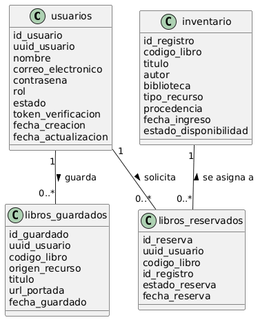
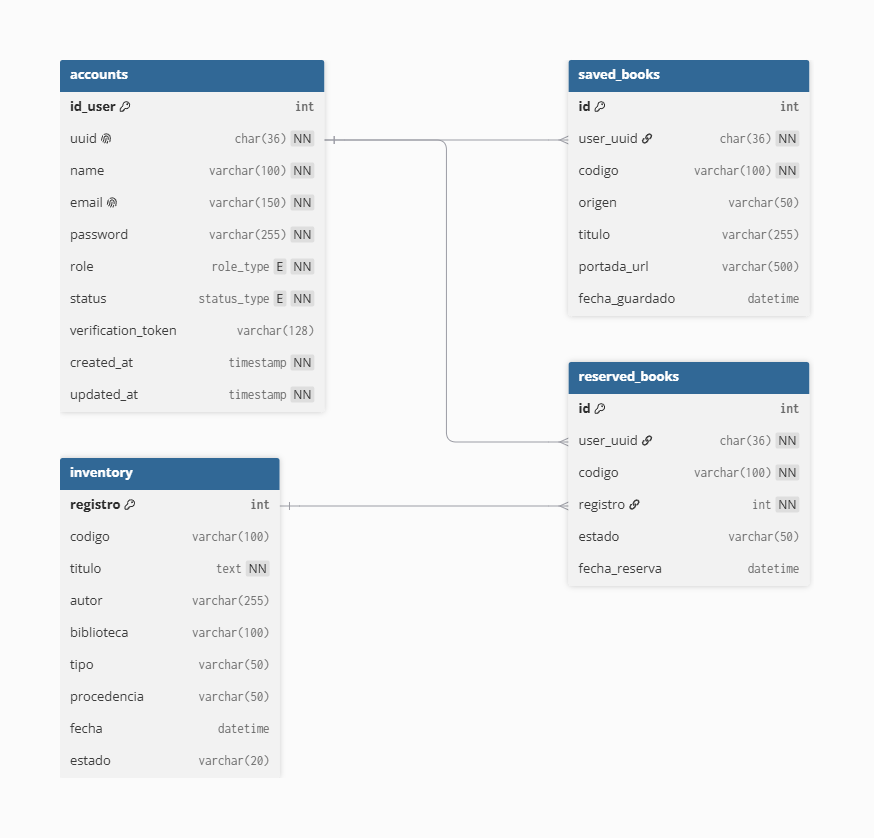

**UNIVERSIDAD PRIVADA DE TACNA**

**FACULTAD DE INGENIERÍA**

**Escuela Profesional de Ingeniería de Sistemas**

#  **Sistema NexusLib**

Curso: Patrones de Software

Docente: Ing. Patrick Cuadros Quiroga

Integrantes:

***Hurtado Ortiz, Leandro Diego		(2015052384)***  
***Flores Navarro, Eduardo Gino		(2023076793)***  
***Cortez Mamani, Julio Samuel		(2023077283)***

**Tacna – Perú**  
**2026**

# **Sistema NexusLib**

# **Diccionario de Datos**

# 

# **Versión 1.0**

**ÍNDICE GENERAL**

Contenido  
[**1\. Modelo Entidad / relación**	4](#1.-modelo-entidad-/-relación)

[1.1. Diseño lógico	4](#1.1.-diseño-lógico)

[1.2. Diseño Físico	4](#1.2.-diseño-físico)

[**2\. DICCIONARIO DE DATOS**	5](#2.-diccionario-de-datos)

[2.1. Tablas	5](#2.1.-tablas)

[Tabla: accounts	5](#tabla:-accounts)

[Tabla: inventory	7](#tabla:-inventory)

[Tabla: saved\_books	8](#tabla:-saved_books)

[Tabla: reserved\_books	10](#tabla:-reserved_books)

[2.2. Lenguaje de Definición de Datos (DDL)	11](#2.2.-lenguaje-de-definición-de-datos-\(ddl\))

[2.3. Lenguaje de Manipulación de Datos (DML)	13](#2.3.-lenguaje-de-manipulación-de-datos-\(dml\))

**Diccionario de Datos**

# **1\. Modelo Entidad / relación** {#1.-modelo-entidad-/-relación}

## **1.1. Diseño lógico** {#1.1.-diseño-lógico}

*Figura N°1: Diagrama del Diseño Logico*

## 1.2. **Diseño Físico** {#1.2.-diseño-físico}

*Figura N°2: Diagrama de Diseño Físico*

# **2\. DICCIONARIO DE DATOS** {#2.-diccionario-de-datos}

## **2.1. Tablas** {#2.1.-tablas}

### **Tabla: accounts** {#tabla:-accounts}

| Nombre de la Tabla: | accounts |
| ----- | ----- |
| Nombres de la Tabla: | Cuentas de Usuarios |
| Descripción de la Tabla: | Almacena la información de identidad, credenciales y estado de autenticación de todos los usuarios (usuarios generales y administradores) de la plataforma NexusLib. |
| Objetivo: | Administrar el control de acceso del sistema, la asignación de roles y proveer el identificador único universal (UUID) que asocia las acciones del usuario en los demás microservicios de forma desacoplada. |
| Relaciones con otras tablas: | Relacionada de manera lógica con las tablas saved\_books y reserved\_books mediante el campo común uuid. |

| Nr. | Nombre del campo | Tipo de dato | Longitud | Permite nulos | Clave primaria | Clave foránea | Descripción del campo |
| :---- | :---- | :---- | :---- | :---- | :---- | :---- | :---- |
| 1 | id\_user | INT | 11 | No | Sí | No | Identificador numérico correlativo autoincremental de control interno en el servicio de autenticación. |
| 2 | uuid | CHAR | 36 | No | No | No | Identificador Único Universal (UUIDv4) generado por software para relacionar al usuario entre microservicios de manera lógica. |
| 3 | name | VARCHAR | 100 | No | No | No | Nombres y apellidos completos del usuario registrado en la plataforma. |
| 4 | email | VARCHAR | 150 | No | No | No | Dirección de correo electrónico institucional única asociada a la cuenta del usuario. |
| 5 | password | VARCHAR | 255 | No | No | No | Contraseña de acceso al sistema encriptada mediante el algoritmo seguro de hash BCrypt. |
| 6 | role | ENUM | \- | No | No | No | Rol asignado en el sistema para control de accesos ('user' para usuarios, 'admin' para administradores). |
| 7 | status | ENUM | \- | No | No | No | Estado operativo de la cuenta de usuario ('active' para validados, 'inactive' para cuentas pendientes). |
| 8 | verification\_token | VARCHAR | 128 | Sí | No | No | Token temporal aleatorio utilizado para el proceso de verificación de identidad por correo electrónico. |
| 9 | created\_at | TIMESTAMP | \- | No | No | No | Fecha y hora exacta en la que se realizó el registro inicial de la cuenta en el sistema. |
| 10 | updated\_at | TIMESTAMP | \- | No | No | No | Fecha y hora de la última modificación o actualización de datos realizada sobre el registro. |

### **Tabla: inventory** {#tabla:-inventory}

| Nombre de la Tabla: | inventory |
| ----- | ----- |
| Nombres de la Tabla: | Inventario de Libros |
| Descripción de la Tabla: | Almacena los metadatos detallados y el estado físico de los ejemplares disponibles en las estanterías de la biblioteca universitaria. |
| Objetivo: | Controlar el catálogo de textos físicos, su procedencia, clasificación y gestionar el estado de disponibilidad para los procesos de reserva de los alumnos. |
| Relaciones con otras tablas: | Relacionada de manera lógica con la tabla reserved\_books mediante el campo común registro. |

| Nr. | Nombre del campo | Tipo de dato | Longitud | Permite nulos | Clave primaria | Clave foránea | Descripción del campo |
| :---- | :---- | :---- | :---- | :---- | :---- | :---- | :---- |
| 1 | registro | INT | 11 | No | Sí | No | Identificador numérico único de control físico asignado individualmente a cada ejemplar en estantería. |
| 2 | codigo | VARCHAR | 100 | Sí | No | No | Código de barras o sistema de catalogación general del texto dentro de la biblioteca. |
| 3 | titulo | TEXT | \- | No | No | No | Título completo oficial del recurso bibliográfico o libro. |
| 4 | autor | VARCHAR | 255 | Sí | No | No | Nombre del autor o autores responsables de la creación de la obra. |
| 5 | biblioteca | VARCHAR | 100 | Sí | No | No | Nombre o código de la biblioteca física institucional de la universidad donde se ubica el ejemplar. |
| 6 | tipo | VARCHAR | 50 | Sí | No | No | Categoría o formato del elemento físico indexado (ej. Libro, Tesis, Revista). |
| 7 | procedencia | VARCHAR | 50 | Sí | No | No | Origen del recurso físico dentro de la institución (ej. Donación, Compra Directa). |
| 8 | fecha | DATETIME | \- | Sí | No | No | Fecha y hora en la que se ingresó o registró físicamente el elemento en el catálogo general. |
| 9 | estado | VARCHAR | 20 | Sí | No | No | Estado de disponibilidad en tiempo real del ejemplar (Predeterminado: 'Disponible'). |

### **Tabla: saved\_books** {#tabla:-saved_books}

| Nombre de la Tabla: | saved\_books |
| ----- | ----- |
| Nombres de la Tabla: | Libros Guardados / Favoritos |
| Descripción de la Tabla: | Registra las colecciones personalizadas de marcadores y favoritos digitales que los usuarios estructuran dentro de su sesión. |
| Objetivo: | Permitir al usuario almacenar referencias rápidas a libros digitales extraídos de fuentes externas como Alpha Cloud o e-Libro para lecturas posteriores. |
| Relaciones con otras tablas: | Relacionada de manera lógica con la tabla accounts mediante el campo user\_uuid. |

| Nr. | Nombre del campo | Tipo de dato | Longitud | Permite nulos | Clave primaria | Clave foránea | Descripción del campo |
| :---- | :---- | :---- | :---- | :---- | :---- | :---- | :---- |
| 1 | id | INT | 11 | No | Sí | No | Identificador numérico correlativo autoincremental único de control de favoritos. |
| 2 | user\_uuid | CHAR | 36 | No | No | Sí (accounts) | UUID del usuario proveniente del microservicio de autenticación que actúa como enlace lógico. |
| 3 | codigo | VARCHAR | 100 | No | No | No | Código general del libro o ID de persistencia único extraído desde los scrapers digitales externos. |
| 4 | origen | VARCHAR | 50 | Sí | No | No | Identificador de la plataforma digital externa de procedencia (ej. 'Alpha Cloud', 'e-Libro'). |
| 5 | titulo | VARCHAR | 255 | Sí | No | No | Título del libro digital capturado por los servicios de extracción al momento de guardarse. |
| 6 | portada\_url | VARCHAR | 500 | Sí | No | No | Enlace web o URL absoluta de la imagen de portada del libro para la renderización en el frontend. |
| 7 | fecha\_guardado | DATETIME | \- | Sí | No | No | Fecha y hora del servidor en la que el usuario incorporó el recurso a su colección personal de favoritos. |

### **Tabla: reserved\_books** {#tabla:-reserved_books}

| Nombre de la Tabla: | reserved\_books |
| ----- | ----- |
| Nombres de la Tabla: | Libros Reservados / Apartados |
| Descripción de la Tabla: | Gestiona las solicitudes activas de separación y el historial de apartados de libros físicos que los alumnos realizan sobre el inventario. |
| Objetivo: | Orquestar el flujo transaccional de préstamos temporales, protegiendo que un mismo ejemplar físico no sea reservado de forma simultánea. |
| Relaciones con otras tablas: | Relacionada de manera lógica con la tabla accounts mediante user\_uuid y con inventory mediante registro. |

| Nr. | Nombre del campo | Tipo de dato | Longitud | Permite nulos | Clave primaria | Clave foránea | Descripción del campo |
| :---- | :---- | :---- | :---- | :---- | :---- | :---- | :---- |
| 1 | id | INT | 11 | No | Sí | No | Identificador numérico correlativo autoincremental único de control de reservas en el sistema. |
| 2 | user\_uuid | CHAR | 36 | No | No | Sí (accounts) | UUID del usuario que genera el apartado, mapeado lógicamente desde el auth-service. |
| 3 | codigo | VARCHAR | 100 | No | No | No | Código bibliográfico o signatura topográfica de catalogación general del libro reservado. |
| 4 | registro | INT | 11 | No | No | Sí (inventory) | Número de registro del ejemplar físico específico apartado, sirviendo como enlace lógico con el inventario. |
| 5 | estado | VARCHAR | 50 | Sí | No | No | Estado operativo del trámite de la reserva (ej. 'Pendiente', 'Entregado', 'Cancelado'). |
| 6 | fecha\_reserva | DATETIME | \- | Sí | No | No | Fecha y hora del servidor en la que se consolidó de manera exitosa la solicitud de separación física. |

## 2.2. **Lenguaje de Definición de Datos (DDL)** {#2.2.-lenguaje-de-definición-de-datos-(ddl)}

CREATE DATABASE IF NOT EXISTS \`bd\_nexus\` /\*\!40100 DEFAULT CHARACTER SET utf8mb4 COLLATE utf8mb4\_general\_ci \*/;  
USE \`bd\_nexus\`;

CREATE TABLE IF NOT EXISTS \`accounts\` (  
  \`id\_user\` int(11) NOT NULL AUTO\_INCREMENT,  
  \`uuid\` char(36) NOT NULL COMMENT 'Identificador único universal para los microservicios',  
  \`name\` varchar(100) NOT NULL,  
  \`email\` varchar(150) NOT NULL,  
  \`password\` varchar(255) NOT NULL,  
  \`role\` enum('user','admin') NOT NULL DEFAULT 'user',  
  \`status\` enum('active','inactive') NOT NULL DEFAULT 'inactive',  
  \`verification\_token\` varchar(128) DEFAULT NULL,  
  \`created\_at\` timestamp NOT NULL DEFAULT current\_timestamp(),  
  \`updated\_at\` timestamp NOT NULL DEFAULT current\_timestamp() ON UPDATE current\_timestamp(),  
  PRIMARY KEY (\`id\_user\`),  
  UNIQUE KEY \`uuid\` (\`uuid\`),  
  UNIQUE KEY \`email\` (\`email\`)  
) ENGINE=InnoDB AUTO\_INCREMENT=13 DEFAULT CHARSET=utf8mb4 COLLATE=utf8mb4\_unicode\_ci;

CREATE TABLE IF NOT EXISTS \`inventory\` (  
  \`registro\` int(11) NOT NULL,  
  \`codigo\` varchar(100) DEFAULT NULL,  
  \`titulo\` text NOT NULL,  
  \`autor\` varchar(255) DEFAULT NULL,  
  \`biblioteca\` varchar(100) DEFAULT NULL,  
  \`tipo\` varchar(50) DEFAULT NULL,  
  \`procedencia\` varchar(50) DEFAULT NULL,  
  \`fecha\` datetime DEFAULT NULL,  
  \`estado\` varchar(20) DEFAULT 'Disponible',  
  PRIMARY KEY (\`registro\`)  
) ENGINE=InnoDB DEFAULT CHARSET=utf8mb4 COLLATE=utf8mb4\_general\_ci;

CREATE TABLE IF NOT EXISTS \`reserved\_books\` (  
  \`id\` int(11) NOT NULL AUTO\_INCREMENT,  
  \`user\_uuid\` char(36) NOT NULL COMMENT 'UUID proveniente del auth-service',  
  \`codigo\` varchar(100) NOT NULL,  
  \`registro\` int(11) NOT NULL COMMENT 'Registro del ejemplar físico',  
  \`estado\` varchar(50) DEFAULT 'Pendiente',  
  \`fecha\_reserva\` datetime DEFAULT current\_timestamp(),  
  PRIMARY KEY (\`id\`),  
  UNIQUE KEY \`unique\_user\_reserved\` (\`user\_uuid\`,\`registro\`)  
) ENGINE=InnoDB AUTO\_INCREMENT=11 DEFAULT CHARSET=utf8mb4 COLLATE=utf8mb4\_general\_ci;

CREATE TABLE IF NOT EXISTS \`saved\_books\` (  
  \`id\` int(11) NOT NULL AUTO\_INCREMENT,  
  \`user\_uuid\` char(36) NOT NULL COMMENT 'UUID proveniente del auth-service',  
  \`codigo\` varchar(100) NOT NULL COMMENT 'Código del libro general',  
  \`origen\` varchar(50) DEFAULT NULL,  
  \`titulo\` varchar(255) DEFAULT NULL,  
  \`portada\_url\` varchar(500) DEFAULT NULL,  
  \`fecha\_guardado\` datetime DEFAULT current\_timestamp(),  
  PRIMARY KEY (\`id\`),  
  UNIQUE KEY \`unique\_user\_saved\` (\`user\_uuid\`,\`codigo\`,\`origen\`)  
) ENGINE=InnoDB AUTO\_INCREMENT=19 DEFAULT CHARSET=utf8mb4 COLLATE=utf8mb4\_general\_ci;

## **2.3. Lenguaje de Manipulación de Datos (DML)** {#2.3.-lenguaje-de-manipulación-de-datos-(dml)}

\-- \=========================================================================  
\-- 1\. INSERT (Inserción de datos en las tablas)  
\-- \=========================================================================

\-- Inserción de usuarios en la tabla 'accounts' (Realizado por auth-service)  
\-- Nota: Las contraseñas están representadas con hashes simulados tipo BCrypt  
INSERT INTO \`accounts\` (\`uuid\`, \`name\`, \`email\`, \`password\`, \`role\`, \`status\`, \`verification\_token\`) VALUES  
('e3b0c442-98fc-11eb-a8b3-0242ac130003', 'Leandro Diego Hurtado Ortiz', 'lhurtadoo@upt.pe', '$2y$10$MzEyMDUyMzg0TmV4dXNMaWJVUFQye...', 'user', 'active', NULL),  
('f4c1d553-99fd-12ec-b9c4-0353bd241114', 'Administrador General Biblioteca', 'admin\_biblioteca@upt.pe', '$2y$10$QWRtaW5OZXh1c0xpYlVQVDIwMjZ...', 'admin', 'active', NULL),  
('a1b2c3d4-1234-5678-90ab-cdef12345678', 'Juan Perez Gomez', 'jperezg@upt.pe', '$2y$10$VGVzdFBhc3N3b3JkTmV4dXNMaWI...', 'user', 'inactive', 'token\_v4\_xyz123');

\-- Inserción de catálogo físico en la tabla 'inventory' (Carga inicial / Control de stock)  
INSERT INTO \`inventory\` (\`registro\`, \`codigo\`, \`titulo\`, \`autor\`, \`biblioteca\`, \`tipo\`, \`procedencia\`, \`fecha\`, \`estado\`) VALUES  
(10521, 'INF-452', 'Introducción a la Arquitectura de Microservicios', 'Martin Fowler', 'Central UPT', 'Libro', 'Compra Directa', '2026-02-15 09:30:00', 'Disponible'),  
(10522, 'INF-452', 'Introducción a la Arquitectura de Microservicios', 'Martin Fowler', 'Central UPT', 'Libro', 'Compra Directa', '2026-02-15 09:30:00', 'Prestado'),  
(20145, 'TES-881', 'Diseño de un API Gateway distribuido empleando PHP', 'Hurtado, L.', 'FAING', 'Tesis', 'Donación', '2026-05-10 14:15:00', 'Disponible');

\-- Inserción de favoritos en la tabla 'saved\_books' (Realizado por user-library-service)  
\-- Nota: Almacena recursos físicos de la UPT y recursos digitales de scrapers (Alpha/e-Libro)  
INSERT INTO \`saved\_books\` (\`user\_uuid\`, \`codigo\`, \`origen\`, \`titulo\`, \`portada\_url\`) VALUES  
('e3b0c442-98fc-11eb-a8b3-0242ac130003', 'INF-452', 'Inventario UPT', 'Introducción a la Arquitectura de Microservicios', 'http://localhost/nexuslib/covers/inf452.jpg'),  
('e3b0c442-98fc-11eb-a8b3-0242ac130003', 'alpha-9921', 'Alpha Cloud', 'Desarrollo de Software Seguro en la Nube', 'https://alpha.cloud/covers/9921.png'),  
('a1b2c3d4-1234-5678-90ab-cdef12345678', 'elibro-4412', 'e-Libro', 'Ingeniería de Requisitos Avanzada', 'https://elibro.net/covers/4412.jpg');

\-- Inserción de apartados en la tabla 'reserved\_books' (Realizado por user-library-service)  
INSERT INTO \`reserved\_books\` (\`user\_uuid\`, \`codigo\`, \`registro\`, \`estado\`) VALUES  
('e3b0c442-98fc-11eb-a8b3-0242ac130003', 'INF-452', 10522, 'Pendiente');

\-- \=========================================================================  
\-- 2\. SELECT (Consultas de datos en las tablas)  
\-- \=========================================================================

\-- Consultar la información de perfil de un usuario por su Email (Para el Login)  
SELECT \`id\_user\`, \`uuid\`, \`name\`, \`password\`, \`role\`, \`status\`   
FROM \`accounts\`   
WHERE \`email\` \= 'lhurtadoo@upt.pe';

\-- Consultar los libros guardados/favoritos de un usuario específico mediante su UUID  
\-- (Usado para renderizar la biblioteca personalizada en el Dashboard del Alumno)  
SELECT \`id\`, \`codigo\`, \`origen\`, \`titulo\`, \`portada\_url\`, \`fecha\_guardado\`  
FROM \`saved\_books\`  
WHERE \`user\_uuid\` \= 'e3b0c442-98fc-11eb-a8b3-0242ac130003'  
ORDER BY \`fecha\_guardado\` DESC;

\-- Consultar la lista de reservas activas mostrando los datos del libro físico asociado  
\-- (Consulta lógica simulada mediante JOIN para auditoría o reportes administrativos)  
SELECT rb.\`id\` AS 'ID Reserva', acc.\`name\` AS 'Alumno', inv.\`titulo\` AS 'Libro', rb.\`registro\` AS 'Copia Nro', rb.\`estado\`, rb.\`fecha\_reserva\`  
FROM \`reserved\_books\` rb  
JOIN \`accounts\` acc ON rb.\`user\_uuid\` \= acc.\`uuid\`  
JOIN \`inventory\` inv ON rb.\`registro\` \= inv.\`registro\`;

\-- Verificar la disponibilidad de un ejemplar físico específico en el almacén  
SELECT \`registro\`, \`codigo\`, \`titulo\`, \`estado\`   
FROM \`inventory\`   
WHERE \`registro\` \= 10522;

\-- \=========================================================================  
\-- 3\. UPDATE (Actualizar datos en las tablas)  
\-- \=========================================================================

\-- Activar una cuenta de usuario y limpiar el token (Cuando confirma el enlace en su correo)  
UPDATE \`accounts\`   
SET \`status\` \= 'active', \`verification\_token\` \= NULL   
WHERE \`verification\_token\` \= 'token\_v4\_xyz123';

\-- Cambiar el estado de un ejemplar en el inventario (Cuando se procesa una reserva)  
\-- (Disparado internamente mediante la ruta /internal/sync-state)  
UPDATE \`inventory\`   
SET \`estado\` \= 'Prestado'   
WHERE \`registro\` \= 10522;

\-- Actualizar el estado de la reserva cuando el administrador entrega el libro físico  
UPDATE \`reserved\_books\`   
SET \`estado\` \= 'Entregado'   
WHERE \`user\_uuid\` \= 'e3b0c442-98fc-11eb-a8b3-0242ac130003' AND \`registro\` \= 10522;

\-- \=========================================================================  
\-- 4\. DELETE (Eliminar datos de las tablas)  
\-- \=========================================================================

\-- Eliminar un libro de la colección de favoritos (Cuando el usuario presiona "Quitar de favoritos")  
DELETE FROM \`saved\_books\`   
WHERE \`user\_uuid\` \= 'e3b0c442-98fc-11eb-a8b3-0242ac130003' AND \`codigo\` \= 'alpha-9921' AND \`origen\` \= 'Alpha Cloud';

\-- Cancelar y remover una solicitud de reserva del sistema  
DELETE FROM \`reserved\_books\`   
WHERE \`id\` \= 1;

